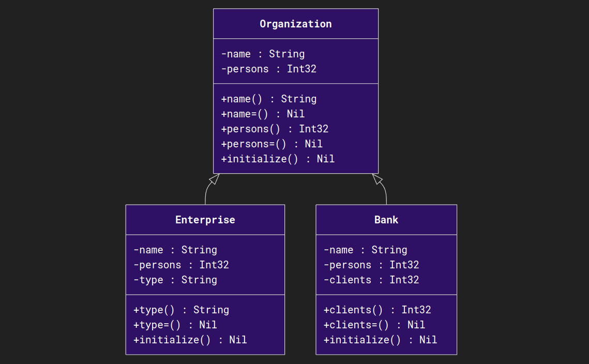

# cruml


[](https://github.com/tamdaz/cruml/actions/workflows/crystal.yml)
[](https://github.com/tamdaz/cruml/actions/workflows/ci-docs.yml)

> [!WARNING]
> This library is under development, it is not completely finished.

**cruml** *(**Cr**ystal **UML**)* is a library that allows to generate a UML diagram.
This is useful for any Crystal projects.


> A class diagram that represents the parent class, linked with inherited classes.

## Installation

1. Add the dependency to your `shard.yml`:

```yaml
dependencies:
  cruml:
    github: tamdaz/cruml
```

2. Run `shards install`

## Usage

```crystal
require "cruml"

module Project
  # ...
end

# Your project module (e.g: Project)
::CRUML_FILTER_PREFIX = "Project"

# Directory where the diagram will be saved.
::CRUML_OUT_DIR = "./out/"

Cruml.run
```

Cruml uses macros to retrieve the names of classes and the names and types of instance variables and methods.

## Contributing

1. Fork it (<https://github.com/tamdaz/cruml/fork>)
2. Create your feature branch (`git checkout -b my-new-feature`)
3. Commit your changes (`git commit -am 'Add some feature'`)
4. Push to the branch (`git push origin my-new-feature`)
5. Create a new Pull Request

## Contributors

- [tamdaz](https://github.com/tamdaz) - creator and maintainer
