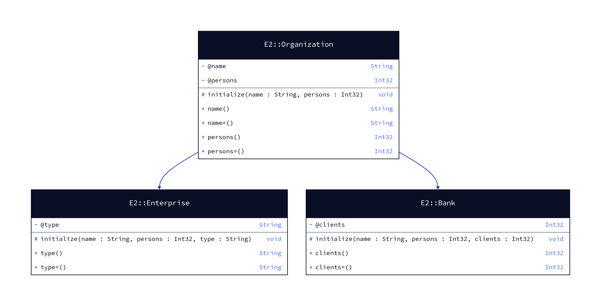

# cruml


[](https://github.com/tamdaz/cruml/actions/workflows/ci.yml)
[](https://crystaldoc.info/github/tamdaz/cruml/main/index.html)

> [!WARNING]
> This tool is under development, it is not completely finished.

**cruml** *(**Cr**ystal **UML**)* is a tool that allows to generate an UML diagram. This is useful for all projects using the Crystal language that need to know their structure.



> An UML class diagram representing the parent class linked to child classes.

## Requirements

To do this, d2 should be installed in your machine.

Documentation source : https://d2lang.com/tour/install#install-script.

## Compatibilities

Here is the compatibility table:

| Cruml version | Crystal version   |
|---------------|-------------------|
| >>> soon...                       |
| v0.7.1        | v1.16.x & v1.17.x |
| v0.7.0        | v1.16.0 & v1.16.1 |

> [!TIP]
> Table is subject to change.

## Installation

1. Add the dependency to your `shard.yml`:

```yaml
development_dependencies:
  cruml:
    github: tamdaz/cruml
```

2. Run `shards install`.

Once this tool installed, this will build a binary into `bin/` directory in your project.

## Usage

```
Usage : cruml [subcommand] [arguments] -- [options]
    config                           Configuration
    generate                         Generate the class diagram
    -v, --version                    Show the version
    -h, --help                       Show this help
```

```
Usage : cruml generate [arguments] -- [options]
    -v, --version                    Show the version
    -h, --help                       Show this help
    --verbose                        Enable verbose
    --dark-mode                      Set to dark mode
    --no-color                       Disable color output
    --path=PATH                      Path to specify
    --output-dir=DIR                 Directory path to save diagrams
```

```
Usage : cruml [subcommand] [arguments] -- [options]
    -v, --version                    Show the version
    -h, --help                       Show this help
    --generate                       Generate a YML config
```

## Examples

For example, to generate a diagram with Crystal files from the `src/models` directory:

```sh
bin/cruml generate --path="src/models"
```

To generate a diagram with one Crystal file:

```sh
bin/cruml generate --path="src/models/user.cr"
```

> [!TIP]
> You can use multiple `--path` flag to include several files or directories.

In addition, you can set your diagram to the dark mode thanks to `--dark-mode` flag:

```sh
bin/cruml generate --path="src/models" --dark-mode
```

If you don't want to colorize the diagram, you can use the `--no-color` flag:

```sh
bin/cruml generate --path="src/models" --no-color
```

## Configuration

Flags are useful to generate the class diagram. In addition, you can use the YML config file to group namespaces,
customize the color of the classifiers and add paths.

```yml
colors:
  light:
    classes: "#baa7e5"
    abstract_classes: "#a7e5a7"
    interfaces: "#e2c7a3"
    modules: "#5ab3f4"
  dark:
    classes: "#2e1065"
    abstract_classes: "#365314"
    interfaces: "#af6300"
    modules: "#0041cc"

paths:
  - src/entities
  - src/controllers
  - src/services

namespaces:
  MyNamespace:
    - App::Services::ClassOne
    - App::Services::ClassTwo
    - App::Services::ClassThree
```

Thanks to this config, you will not need to use flags in the CLI, just run `bin/cruml generate`.

## Troubleshooting

- Tool cannot know if there are objects in the recursive modules.
- d2 binary cannot display the multi-line method signature.
- Fonts cannot be automatically customized _(unless we manually edit the SVG file once generated)_. We'll see if d2 contributors can implement this feature later.
- Return type of a method should be indicated explicity, otherwise it will display `void`.
- Recursive modules aren't supported for the moment. For example, if you have a code that look like this:

```crystal
module MyModule
  module MySubModule
    class MyClass
      getter name : String
    end
  end
end
```

It will get only the class `MyClass` but the namespace will not be prefixed with (`MyModule::MySubModule::MyClass`).
If you want to include the namespace in your class name, you have to use the implicit namespace by doing this:

```crystal
class MyModule::MySubModule::MyClass
  getter name : String
end
```

## Contributing

1. Fork it (<https://github.com/tamdaz/cruml/fork>)
2. Create your feature branch (`git checkout -b my-new-feature`)
3. Commit your changes (`git commit -am 'Add some feature'`)
4. Push to the branch (`git push origin my-new-feature`)
5. Create a new Pull Request

## Contributors

- [tamdaz](https://github.com/tamdaz) - creator and maintainer
